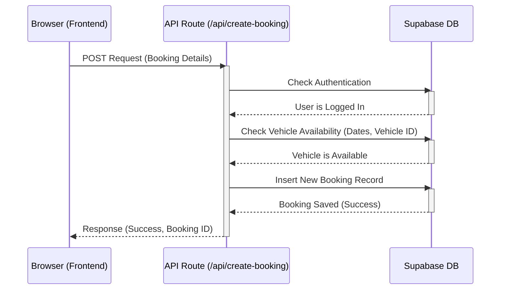

# Chapter 1: API Routes (`src/app/api/`)

Welcome to the Siargao Rides Summarised project! This is the first chapter in our journey to understand how this application works. We'll start with a fundamental concept: **API Routes**.

## What Problem Do API Routes Solve?

Imagine you're building the Siargao Rides website. Users need to book motorbikes, shops need to list their vehicles, and administrators need to verify those shops.

Where does the actual "work" happen?

*   The **frontend** (what you see in your browser) is great for displaying information and collecting input from users (like filling out a booking form).
*   However, the frontend *cannot* directly and securely talk to our database to save a booking or check sensitive information like whether a shop is verified. Doing so would expose secret keys and allow anyone to tamper with the data!

We need a secure "middleman" that lives on our server. This middleman takes requests from the frontend, performs actions securely (like talking to the database), and sends back results.

This is exactly what **API Routes** do in our Next.js application!

## Meet the "Help Desks": API Routes

Think of API Routes as specialized **help desks** running on our server. They live inside the `src/app/api/` folder in our project. Each file or folder inside `src/app/api/` represents a different help desk, identified by its URL path.

*   Need to create a new booking? The frontend sends a request to the "Create Booking Desk" at the URL `/api/create-booking`.
*   Need to verify a rental shop? An admin user's browser sends a request to the "Shop Verification Desk" at `/api/shops/verify`.
*   Need to register a new user? The frontend calls the "Registration Desk" at `/api/auth/register`.

These API Routes contain the server-side logic. They are the only part of our application allowed to perform sensitive tasks, like:

1.  Directly interacting with our database (often using special admin privileges). We'll learn more about this in [Chapter 2: Supabase Backend & Admin Client](02_supabase_backend___admin_client_.md).
2.  Handling payments securely with services like PayMongo (See [Chapter 7: Payment System (PayMongo)](07_payment_system__paymongo__.md)).
3.  Enforcing rules, like checking if a user is an administrator before allowing them to perform admin actions (See [Chapter 3: Authentication & User Roles (AuthContext)](03_authentication___user_roles__authcontext__.md)).

## How It Works: A Simple Booking Example

Let's trace a simple booking request:

1.  **User Action (Frontend):** You choose a motorbike, select dates, and click "Book Now" on the website in your browser.
2.  **Frontend Request:** Your browser sends the booking details (vehicle ID, dates, etc.) as a request to the specific API Route URL: `/api/create-booking`.
3.  **API Route Execution (Server):** The code inside the file `src/app/api/create-booking/route.ts` runs on our secure server.
4.  **Server-Side Logic:** The API route performs several steps:
    *   Checks if you are logged in.
    *   Validates the received data (Are the dates valid? Does the vehicle exist?).
    *   Connects to the database to check if the motorbike is available for your selected dates.
    *   Calculates the total price.
    *   If everything is okay, it securely saves the new booking details into the database.
    *   Prepares a response message (e.g., "Booking successful!" or "Sorry, vehicle not available").
5.  **Server Response:** The API route sends the response back to your browser.
6.  **User Feedback (Frontend):** Your browser receives the response and displays the message (e.g., a confirmation screen or an error alert).

Notice how the database interaction and availability checks happen *only* on the server within the API route, keeping everything secure.

## A Peek at the Code (Simplified)

Inside the `src/app/api/` directory, files named `route.ts` contain the code for these "help desks". They often export functions named after HTTP methods like `GET` (for fetching data) or `POST` (for creating data).

Here's a *very simplified* look at what `src/app/api/create-booking/route.ts` might do:

```typescript
// File: src/app/api/create-booking/route.ts
import { NextRequest, NextResponse } from 'next/server';
// We'll learn about this in Chapter 2!
import { createServerComponentClient } from '@supabase/auth-helpers-nextjs'; 
import { cookies } from 'next/headers';

// This function handles POST requests to /api/create-booking
export async function POST(request: NextRequest) {
  try {
    // 1. Get the data sent from the frontend
    const bookingDetails = await request.json(); 
    
    // 2. Initialize a secure connection to the database
    const supabase = createServerComponentClient({ cookies }); 

    // 3. Check if the user is logged in (simplified)
    // (More on authentication in Chapter 3)
    const { data: { session } } = await supabase.auth.getSession();
    if (!session) {
      return NextResponse.json({ error: 'Please log in' }, { status: 401 });
    }

    // 4. TODO: Validate the bookingDetails (dates, vehicle ID, etc.)
    console.log('Received booking details:', bookingDetails);

    // 5. TODO: Check vehicle availability in the database (simplified)
    const isAvailable = true; // Assume available for now

    if (!isAvailable) {
      return NextResponse.json({ error: 'Vehicle not available' }, { status: 409 });
    }

    // 6. TODO: Calculate the total price (simplified)
    const totalPrice = 1000; 

    // 7. TODO: Save the booking to the database (simplified)
    // (More on database interaction in Chapter 2)
    console.log('Saving booking to database...');
    const newBooking = { id: 'booking123', ...bookingDetails, totalPrice };

    // 8. Send a success response back to the frontend
    return NextResponse.json({ success: true, booking: newBooking });

  } catch (error) {
    // Handle any unexpected errors
    console.error('Booking failed:', error);
    return NextResponse.json({ error: 'Booking failed' }, { status: 500 });
  }
}
```

**Explanation:**

*   `import { NextRequest, NextResponse } ...`: We import special tools from Next.js to handle the incoming request (`NextRequest`) and create the outgoing response (`NextResponse`).
*   `export async function POST(request: NextRequest)`: This defines the function that runs when the frontend sends a `POST` request (typically used for creating new things, like a booking).
*   `request.json()`: This reads the data sent by the frontend (like vehicle ID and dates).
*   `supabase.auth.getSession()`: Checks if the user is logged in (more details in [Chapter 3](03_authentication___user_roles__authcontext__.md)).
*   `NextResponse.json({...})`: This sends a JSON response back to the frontend. We include a `status` code (like `200` for OK, `401` for Unauthorized, `500` for Server Error).
*   `// TODO:` Comments mark places where more complex logic (validation, database checks) happens in the real code.

## Under the Hood: The Request Flow

Here's a visual representation of the booking example:



## Folder Structure Maps to URLs

The way you organize files and folders inside `src/app/api/` directly creates the URL paths for your API routes:

*   `src/app/api/create-booking/route.ts` -> accessible at `/api/create-booking`
*   `src/app/api/shops/verify/route.ts` -> accessible at `/api/shops/verify`
*   `src/app/api/payments/create-intent/route.ts` -> accessible at `/api/payments/create-intent`

This convention makes it easy to find the code responsible for a specific server-side task.

## Conclusion

You've learned the basics of API Routes! They are the secure server-side "help desks" in our Next.js application, located in `src/app/api/`. They handle requests from the frontend, perform actions like database operations or payment processing, and send back results. This keeps our sensitive logic and credentials safe on the server.

Many API routes need to interact with our database. In the next chapter, we'll dive into how Siargao Rides Summarised uses Supabase as its backend database and how API routes securely communicate with it, sometimes using special administrative powers.

Ready to see how the database fits in? Let's move on to [Chapter 2: Supabase Backend & Admin Client](02_supabase_backend___admin_client_.md)!

---

Generated by [AI Codebase Knowledge Builder](https://github.com/The-Pocket/Tutorial-Codebase-Knowledge)