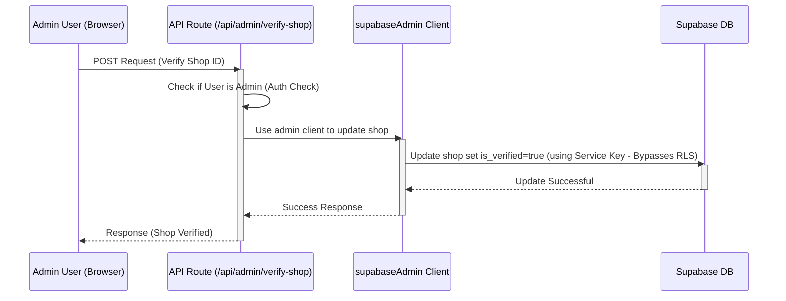

# Chapter 2: Supabase Backend & Admin Client

Welcome back! In [Chapter 1: API Routes (`src/app/api/`)](01_api_routes___src_app_api____.md), we learned about the secure "help desks" (API Routes) that handle tasks on our server. But where does all the information—user details, shop listings, vehicle availability, booking records—actually live? And how do those API routes access and manage it securely?

That's where **Supabase** comes in!

## What Problem Does Supabase Solve?

Imagine Siargao Rides needs a central, organized, and secure place to store *everything*.

*   Where do new users' email addresses and passwords go?
*   Where do shop owners list their motorbikes, prices, and pictures?
*   Where are booking details saved so we know which bike is rented when?

We need a reliable **database** and a system to manage it. We also need ways to handle user logins (**authentication**) and store files like images (**storage**). Building all this from scratch is complex and time-consuming.

Supabase provides all these "backend" services in one package, acting like the **central library** for our Siargao Rides application.

## Meet Supabase: Our Digital Library

Think of Supabase as a super-powered digital library combined with a security office and a media storage room. It offers several key services we use:

1.  **Database (PostgreSQL):** This is the main library floor with organized shelves (tables) holding all our structured information. There are tables for `users`, `rental_shops`, `vehicles`, `rentals` (bookings), and more. It's like having specific sections for different types of books.
2.  **Authentication:** This is the library's front desk and security system. It handles user sign-up, login (email/password, Google), and keeps track of *who* is accessing the application. It issues "library cards" (authentication tokens) to logged-in users. We'll explore this more in [Chapter 3: Authentication & User Roles (AuthContext)](03_authentication___user_roles__authcontext__.md).
3.  **Storage:** This is like the library's media room. It's where we store files that don't fit neatly into database tables, like profile pictures, shop logos, and vehicle images.
4.  **Row Level Security (RLS):** This is a crucial security feature built into the database. Think of it as strict rules enforced by the librarians. For example, a rule might say: "A shop owner can only see and edit *their own* shop's details, not anyone else's." RLS ensures users can only access the data they are permitted to see or modify, even if they try to be clever.

## The Normal Way: Accessing Supabase Securely

Most of the time, when our application (either the frontend making a request *through* an API route, or the API route itself) needs data from Supabase, it uses a *regular* Supabase client. This client uses the logged-in user's "library card" (authentication token) to talk to Supabase.

Because it uses the user's credentials, Supabase automatically enforces the RLS rules. If a regular user tries to fetch *all* shop details, RLS will only return the shops they are allowed to see (which might be all public ones, but not private drafts).

Here's how an API route might typically fetch public shop data:

```typescript
// Simplified example within an API route
import { createServerComponentClient } from '@supabase/auth-helpers-nextjs';
import { cookies } from 'next/headers';
import { Database } from '@/lib/database.types'; // Types describing our database structure

export async function GET() {
  // Create a Supabase client that respects RLS
  const supabase = createServerComponentClient<Database>({ cookies });

  // Fetch data from the 'rental_shops' table
  const { data: shops, error } = await supabase
    .from('rental_shops') // Select the 'rental_shops' table (shelf)
    .select('*')         // Get all columns (book details)
    .eq('is_verified', true); // Only get shops that are verified (public)

  if (error) {
    console.error('Error fetching shops:', error);
    // Handle error...
  }

  // Send the fetched shops back to the browser
  return Response.json({ shops });
}
```

**Explanation:**

*   `createServerComponentClient`: This function (from a Supabase helper library) creates a Supabase client suitable for use within server components or API routes. It automatically uses the logged-in user's context if available.
*   `supabase.from('rental_shops').select('*').eq('is_verified', true)`: This is how we ask Supabase for data. It reads like: "From the `rental_shops` table, select all columns where the `is_verified` column is `true`." Crucially, Supabase will *also* apply any relevant RLS policies behind the scenes based on who is making the request.

## The Special Key: `supabaseAdmin` Client

Sometimes, our API routes need to perform actions that *shouldn't* be restricted by the normal RLS rules that apply to regular users or even shop owners. Think about tasks only the head librarian or system administrator should perform:

*   Verifying a new shop listing.
*   Directly creating a user account during a special process.
*   Updating system-wide settings.

For these situations, we need a way to talk to Supabase with **administrator privileges**, essentially telling Supabase, "I know what I'm doing, please bypass the usual user-specific security rules for this one operation."

This is where the `supabaseAdmin` client comes in. It's a special Supabase client configured with a secret **Service Role Key**. This key grants god-mode access to our Supabase backend.

**Crucially:**

*   The `supabaseAdmin` client is **NEVER** used in the frontend (browser).
*   It is **ONLY** used in secure server environments, specifically within our [API Routes (`src/app/api/`)](01_api_routes___src_app_api____.md).
*   The secret Service Role Key needed to initialize it is kept confidential on the server and is never exposed to users.

## Using the `supabaseAdmin` Client

Let's imagine an API route specifically for administrators to verify a shop. A regular shop owner cannot verify their own shop; only an admin can flip that switch.

```typescript
// Simplified example: src/app/api/admin/verify-shop/route.ts
import { NextRequest, NextResponse } from 'next/server';
// Import the SPECIAL admin client
import { supabaseAdmin } from '@/lib/admin'; 
import { Database } from '@/lib/database.types';

export async function POST(request: NextRequest) {
  // 1. TODO: Add strong authentication check: Is the logged-in user REALLY an admin?
  // (We'll cover roles in Chapter 3)
  const isAdmin = true; // Assume admin for this example
  if (!isAdmin) {
    return NextResponse.json({ error: 'Forbidden' }, { status: 403 });
  }

  // 2. Get the shop ID to verify from the request
  const { shopId } = await request.json();
  if (!shopId) {
    return NextResponse.json({ error: 'Missing shopId' }, { status: 400 });
  }

  // 3. Use the supabaseAdmin client to bypass RLS and update the shop
  const { data, error } = await supabaseAdmin
    .from('rental_shops')     // Target the shops table
    .update({ is_verified: true }) // Set the 'is_verified' field to true
    .eq('id', shopId)         // Only for the specific shop ID
    .select()                 // Optionally get the updated shop data back
    .single();                // Expecting only one shop to be updated

  if (error) {
    console.error('Error verifying shop:', error);
    return NextResponse.json({ error: 'Failed to verify shop' }, { status: 500 });
  }

  // 4. Send success response
  return NextResponse.json({ success: true, updatedShop: data });
}
```

**Explanation:**

*   `import { supabaseAdmin } from '@/lib/admin';`: We import the special admin client instead of the regular one.
*   **Admin Check:** The `TODO` comment highlights that *before* using the admin client, the API route MUST rigorously check if the user making the request actually has the 'admin' role. This is vital!
*   `supabaseAdmin.from(...).update(...)`: We use the `supabaseAdmin` client just like the regular client, but Supabase knows this client has the Service Role Key and will allow it to update the `is_verified` field, even if normal RLS policies would prevent it.

## Under the Hood: How `supabaseAdmin` is Created

The `supabaseAdmin` client isn't magic; it's simply initialized with a powerful, secret key.

**File: `src/lib/admin.ts`**

This file is responsible for creating and exporting the admin client:

```typescript
// File: src/lib/admin.ts (Simplified)
import { createClient } from '@supabase/supabase-js';

// 1. Get Supabase URL and the SECRET Service Key from environment variables
const supabaseUrl = process.env.NEXT_PUBLIC_SUPABASE_URL;
const supabaseServiceKey = process.env.SUPABASE_SERVICE_ROLE_KEY; // SECRET KEY!

// 2. Check if the keys are actually set (important!)
if (!supabaseUrl || !supabaseServiceKey) {
  throw new Error('Missing Supabase environment variables for admin client!');
}

// 3. Create the client using the Service Role Key
const supabaseAdmin = createClient(supabaseUrl, supabaseServiceKey, {
  auth: {
    // Settings to ensure it doesn't act like a regular user session
    autoRefreshToken: false,
    persistSession: false,
  },
});

// 4. Export the powerful client for use ONLY in server-side code (API routes)
export { supabaseAdmin };
```

**Explanation:**

1.  It reads the Supabase URL (which is public) and the `SUPABASE_SERVICE_ROLE_KEY` (which is highly secret and stored securely on the server, not in the code repository).
2.  It checks that these values exist.
3.  `createClient(supabaseUrl, supabaseServiceKey, ...)`: This is the core part. It creates a Supabase client instance, but instead of providing a user's authentication token, it provides the `SUPABASE_SERVICE_ROLE_KEY`. This tells Supabase, "This client is an administrator."
4.  It exports the configured `supabaseAdmin` client.

**Interaction Flow Diagram (Admin Verifying Shop):**



This diagram shows how the API route acts as the secure intermediary. It first checks the user's role and *then* uses the privileged `supabaseAdmin` client to perform the action that bypasses normal user restrictions (RLS) in the database.

## Defining Our Library's Structure (`database.types.ts`)

How does our code know what tables (`users`, `rental_shops`, etc.) and columns exist in the Supabase database? Supabase provides tools to generate TypeScript definitions based on our actual database schema. These definitions live in `src/lib/database.types.ts`.

Here's a tiny peek at what the definition for the `rental_shops` table might look like inside that file:

```typescript
// Snippet from src/lib/database.types.ts (Generated)

// ... other table definitions ...

      rental_shops: { // Defines the 'rental_shops' table
        Row: { // What a row looks like when we read it
          id: string           // Unique ID for the shop
          owner_id: string     // Link to the user who owns the shop
          name: string         // Shop's name
          address: string      // Shop's address
          is_verified: boolean // The field our admin API updated!
          // ... other columns like phone_number, logo_url, etc.
          created_at: string
          updated_at: string
        }
        Insert: { // What we need to provide when creating a new shop
          id?: string // ID is usually generated automatically
          owner_id: string
          name: string
          address: string
          is_verified?: boolean // Defaults to false
          // ... other columns ...
        }
        Update: { // What fields we can update
          id?: string
          name?: string // Optional: only update name if provided
          address?: string
          is_verified?: boolean // Optional: update verification status
          // ... other columns ...
        }
      }

// ... other table definitions ...
```

**Explanation:**

*   This file doesn't *create* the database tables; it just *describes* them for TypeScript.
*   It helps us write safer code by providing auto-completion and type checking when we interact with Supabase (e.g., `supabase.from('rental_shops')...`).
*   Seeing `is_verified: boolean` here confirms that our database table has a field to track verification status, which our `supabaseAdmin` client manipulated.

## Conclusion

You've now learned about the heart of our application's backend: **Supabase**.

*   It acts as our central **database**, **authentication** manager, and **file storage**.
*   It uses **Row Level Security (RLS)** to protect data by default.
*   Most interactions use a regular Supabase client that respects RLS.
*   For special server-side administrative tasks that need to bypass RLS (like verifying shops), we use the powerful but securely handled **`supabaseAdmin`** client within our [API Routes (`src/app/api/`)](01_api_routes___src_app_api____.md).

Understanding how data is stored and accessed securely is crucial. Next, we'll dive deeper into how Supabase handles user logins and how we manage different user roles (like tourist, shop owner, and admin) within the application.

Let's explore how we know *who* is using the app: [Chapter 3: Authentication & User Roles (AuthContext)](03_authentication___user_roles__authcontext__.md)!

---

Generated by [AI Codebase Knowledge Builder](https://github.com/The-Pocket/Tutorial-Codebase-Knowledge)