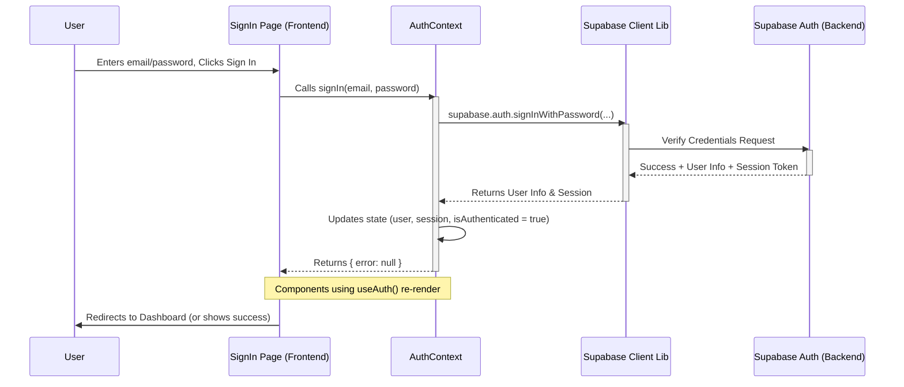

# Chapter 3: Authentication & User Roles (AuthContext)

Welcome back! In [Chapter 2: Supabase Backend & Admin Client](02_supabase_backend___admin_client_.md), we saw how Siargao Rides uses Supabase as its central "library" to store data like user info, shops, and bookings. We also learned about the special `supabaseAdmin` key for administrative tasks.

But how does the app know *who* is using it? How does it make sure only logged-in users can book a motorbike, or only shop owners can add vehicles to their shop? This is where **Authentication** and **User Roles** come in.

## What Problem Does This Solve? The App's Security Guard

Imagine Siargao Rides is like an exclusive club or resort. You can't just walk in and start using the facilities (like booking a motorbike). You need to:

1.  **Register:** Sign up at the front desk to become a member.
2.  **Sign In:** Show your membership card (or prove who you are) each time you enter.
3.  **Have Permissions:** Depending on your membership type (Tourist, Shop Owner, Admin), you have access to different areas and services. A tourist can book rides, a shop owner can manage their listed bikes, and an admin can oversee everything.

Without this "security guard," anyone could pretend to be someone else, access private information, or perform actions they shouldn't.

Our app's security guard is handled by a concept we call **AuthContext**. It manages everything related to user identity and permissions.

## Meet AuthContext: Your App Passport and Access Pass

`AuthContext` acts like your digital passport within the Siargao Rides app. It keeps track of:

1.  **Authentication:** Are you currently logged in? Who are you? (`signIn`, `signUp`, `signOut`)
2.  **User Information:** What's your email, name, unique ID?
3.  **User Role:** What kind of user are you? (`tourist`, `shop_owner`, or `admin`)

It uses [Supabase Backend & Admin Client](02_supabase_backend___admin_client_.md)'s built-in Authentication service to handle the secure parts (like password checking). Then, it makes your "passport" (user information and role) easily available to any part of the app that needs it, using a standard React feature called **Context**.

Think of React Context like a public announcement system in our club. Once you sign in, the `AuthContext` announces "Hey everyone, Jane (Tourist) is here!" Now, different parts of the club (different screens or components in the app) can hear this and react accordingly. The booking form knows Jane is a tourist and can book, while the "Add Vehicle" button knows Jane isn't a shop owner and stays hidden or disabled for her.

## Key Concepts

1.  **Authentication:** The process of verifying *who* a user is. This usually involves an email and password, or signing in via Google. Supabase handles the tricky security aspects of this.
2.  **User Roles:** Different levels of access within the app.
    *   `tourist`: Can browse shops, view vehicles, make bookings, manage their profile.
    *   `shop_owner`: Can do everything a tourist can, PLUS manage their own shop, list/edit vehicles, view their shop's bookings.
    *   `admin`: Can do everything, PLUS verify shops, manage users, access the admin dashboard ([Chapter 8: Admin Dashboard & Verification](08_admin_dashboard___verification_.md)).
3.  **React Context (`AuthContext`):** A mechanism in React to share data (like the current user and their role) across many components without manually passing it down through every level.

## How We Use AuthContext

Let's see how different parts of the app use `AuthContext`. Imagine we have a simple component that shows a welcome message and a sign-out button if the user is logged in.

**File: `src/components/SimpleGreeting.tsx` (Simplified Example)**

```typescript
// Import the hook to use the AuthContext
import { useAuth } from "@/contexts/AuthContext";
import { Button } from "@/components/ui/button"; // Button component

export function SimpleGreeting() {
  // Get auth state and functions from the context
  const { user, isAuthenticated, signOut, isLoading } = useAuth();

  // Show loading message while checking auth status
  if (isLoading) {
    return <p>Loading...</p>;
  }

  // If user is logged in
  if (isAuthenticated && user) {
    return (
      <div>
        {/* Display user's first name (if available) */}
        <p>Welcome, {user.user_metadata?.first_name || 'Rider'}!</p>
        {/* Show a sign-out button */}
        <Button onClick={signOut}>Sign Out</Button>
      </div>
    );
  }

  // If user is not logged in
  return <p>Please sign in to continue.</p>;
}
```

**Explanation:**

1.  `import { useAuth } from "@/contexts/AuthContext";`: We import the special `useAuth` hook provided by our `AuthContext`.
2.  `const { user, isAuthenticated, signOut, isLoading } = useAuth();`: We call `useAuth()` to get the current authentication status (`isAuthenticated`), the user object (`user`), the sign-out function (`signOut`), and a loading flag (`isLoading`).
3.  `if (isLoading)`: We wait until the context has finished checking the user's status.
4.  `if (isAuthenticated && user)`: We check if the user is logged in.
5.  `user.user_metadata?.first_name`: We access the user's information (like their first name, stored in `user_metadata`).
6.  `<Button onClick={signOut}>`: We attach the `signOut` function from the context to the button's click event.

This component doesn't need to know *how* sign-in or sign-out works, or where the user data comes from. It just asks `AuthContext` via the `useAuth` hook!

## Under the Hood: The Sign-In Flow

How does signing in actually update the `AuthContext`?

1.  **User Action:** You go to the sign-in page (`src/app/sign-in/page.tsx`) and enter your email/password.
2.  **Frontend Request:** The sign-in page component calls the `signIn` function it gets from `useAuth()`.
3.  **AuthContext Action:** The `signIn` function inside `AuthContext.tsx` takes the email and password.
4.  **Supabase Call:** `AuthContext` uses the Supabase client library to securely send these credentials to the [Supabase Backend & Admin Client](02_supabase_backend___admin_client_.md) Authentication service.
5.  **Supabase Verification:** Supabase Auth checks if the email exists and the password is correct.
6.  **Supabase Response:** Supabase sends back either success (with user details and a session token) or an error.
7.  **AuthContext Update:** If successful, `AuthContext` receives the user data and session token. It updates its internal state (`user`, `session`, `isAuthenticated`).
8.  **React Re-renders:** Because the context's state changed, React automatically tells any component using `useAuth()` (like our `SimpleGreeting`) that new information is available, causing them to re-render and show the updated view (e.g., the welcome message).

Here's a simplified diagram of the sign-in process:



## Under the Hood: Registration and Roles

Signing up is slightly more complex because we need to tell Supabase the user's *role*.

1.  **User Action:** You fill the sign-up form (`src/app/sign-up/page.tsx`), including selecting whether you want to "Rent Vehicles" (`tourist`) or "List My Vehicles" (`shop_owner`).
2.  **Frontend Request:** The sign-up page calls the `register` function from `useAuth()`, passing email, password, name, and the chosen `role`.
3.  **AuthContext Action (Step 1 - Auth):** The `register` function first calls `supabase.auth.signUp`. This tells Supabase Auth to create the basic authentication entry for the user and send a verification email. It also stores the `firstName`, `lastName`, and `role` in the user's **metadata** within Supabase Auth itself.
4.  **AuthContext Action (Step 2 - API Call):** *Crucially*, after `supabase.auth.signUp` succeeds, the `register` function in `AuthContext` makes a `fetch` request to our own backend [API Route (`src/app/api/`)](01_api_routes___src_app_api____.md) at `/api/auth/register`.
5.  **API Route Execution:** The code in `src/app/api/auth/register/route.ts` runs on our secure server.
6.  **Admin Client Usage:** This API route uses the powerful `supabaseAdmin` client ([Chapter 2: Supabase Backend & Admin Client](02_supabase_backend___admin_client_.md)) to insert a new row into our `public.users` table in the database. It includes the user's ID (from Supabase Auth), email, name, and the chosen `role`. Using the admin client ensures this works even if normal security rules would prevent it.
7.  **Response:** The API route sends back a success or error message.
8.  **AuthContext & User Feedback:** `AuthContext` tells the user to check their email for verification.

Why the two steps?
*   Supabase Auth handles the secure password stuff and email verification.
*   Our API route, using the admin client, ensures the user profile is created in our `users` table with the correct role, linking the Auth user to our application's data structure.

**Simplified Code Snippet from `AuthContext.tsx`:**

```typescript
// File: src/contexts/AuthContext.tsx (Simplified)

// ... imports and context setup ...

export function AuthProvider({ children }: AuthProviderProps) {
  const [user, setUser] = useState<User | null>(null);
  const [session, setSession] = useState<Session | null>(null);
  const [isLoading, setIsLoading] = useState<boolean>(true);
  const supabase = createClientComponentClient();
  // ... other state like isAdmin ...

  // Function to handle user registration
  const register = async (
    email, password, firstName, lastName, role
  ) => {
    setIsLoading(true);
    try {
      // Step 1: Sign up with Supabase Auth (stores role in metadata)
      const { data: authData, error: authError } = await supabase.auth.signUp({
        email, password,
        options: { data: { first_name: firstName, last_name: lastName, role: role } }
      });

      if (authError) throw authError; // Handle error

      if (authData.user) {
        // Step 2: Call our API to create the user record in DB
        await fetch('/api/auth/register', {
          method: 'POST',
          headers: { 'Content-Type': 'application/json' },
          body: JSON.stringify({ userId: authData.user.id, email, firstName, lastName, role }),
        });
        // Handle potential API errors...

        // Redirect user to verify email page
        router.push("/verify-email");
        return { error: null };
      }
      // ... handle case where user wasn't created ...
    } catch (error) {
      // ... handle errors ...
      return { error };
    } finally {
      setIsLoading(false);
    }
  };

  // ... other functions like signIn, signOut ...

  // Listen for auth changes (login, logout)
  useEffect(() => {
    const { data: { subscription } } = supabase.auth.onAuthStateChange(
      (_event, session) => {
        setSession(session);
        setUser(session?.user ?? null);
        // Update isAdmin based on session?.user?.user_metadata?.role
        setIsLoading(false);
      }
    );
    // ... rest of useEffect ...
    return () => subscription.unsubscribe();
  }, [supabase.auth]);

  const value = { /* ... user, session, register, signIn, signOut ... */ };
  return <AuthContext.Provider value={value}>{children}</AuthContext.Provider>;
}
```

**Explanation:**

*   The `register` function orchestrates the two-step process: `supabase.auth.signUp` then `fetch('/api/auth/register')`.
*   `onAuthStateChange` is a listener provided by Supabase. It automatically updates the `AuthContext`'s state whenever the user logs in, logs out, or their session changes. This keeps the app's view consistent with the user's actual authentication status.
*   The `AuthContext.Provider` wraps the entire application, making the `value` (user, session, functions) available everywhere via `useAuth()`.

## Conclusion

You've learned how Siargao Rides handles its security and user access using **Authentication** and **User Roles**, managed primarily by the **`AuthContext`**.

*   It acts as the app's "security guard," handling sign-up, sign-in, and sign-out.
*   It uses [Supabase Backend & Admin Client](02_supabase_backend___admin_client_.md)'s Authentication service securely.
*   It keeps track of the user's role (`tourist`, `shop_owner`, `admin`).
*   It uses React Context to make user information and authentication functions easily accessible throughout the frontend.
*   Registration involves both Supabase Auth (`signUp`) and a call to our own `/api/auth/register` [API Route (`src/app/api/`)](01_api_routes___src_app_api____.md) to ensure the user profile and role are stored correctly in our database.

Now that we know *who* the user is and what their role is, how does the application fetch and manage the specific data they need (like their bookings, or the vehicles for their shop)? That's where the next layer comes in.

Let's explore how we organize data fetching and API calls in [Chapter 4: Data Service & API Layers (`src/lib/service.ts`, `src/lib/api.ts`)](04_data_service___api_layers___src_lib_service_ts____src_lib_api_ts__.md)!

---

Generated by [AI Codebase Knowledge Builder](https://github.com/The-Pocket/Tutorial-Codebase-Knowledge)