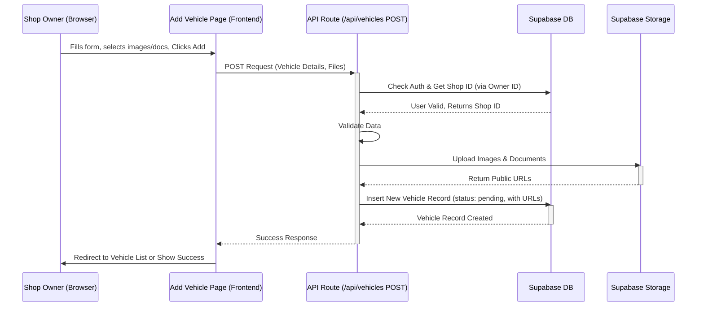

# Chapter 6: Shop & Vehicle Management

Welcome back! In [Chapter 5: Booking System](05_booking_system_.md), we explored how customers find and rent vehicles through Siargao Rides. But how do those vehicles get listed in the first place? And how do the shop owners manage their business information on the platform?

This chapter dives into **Shop & Vehicle Management**, the part of the application built specifically for rental shop owners.

## What Problem Does This Solve? The Shop Owner's Control Center

Imagine you own a motorbike rental shop in Siargao. You want to use the Siargao Rides platform to reach more customers. You'd need a way to:

1.  Create a profile for your shop, showcasing its name, location, and maybe some photos.
2.  List all the motorbikes you have available for rent, including their details (model, price, pictures).
3.  Keep your inventory up-to-date: add new bikes, remove old ones, or temporarily mark a bike as unavailable if it's being repaired.
4.  Update your shop details if your phone number or address changes.

Essentially, you need a **control panel** for your online presence and inventory on the Siargao Rides platform. This is exactly what the Shop & Vehicle Management features provide. It's like the backend dashboard for an online store, where the store owner manages their products and storefront.

## Meet the Control Panel: Shop & Vehicle Dashboard

For users identified as `shop_owner` (thanks to [Chapter 3: Authentication & User Roles (AuthContext)](03_authentication___user_roles__authcontext__.md)), the dashboard provides special sections to manage their business. This "control panel" allows them to handle two main areas:

1.  **Shop Profile Management:** This is where owners manage their virtual storefront. They can:
    *   Update shop name, description, address, contact details (phone, email, WhatsApp).
    *   Upload a shop logo and banner image.
    *   Set their operating location area (e.g., General Luna, Cloud 9).
    *   Manage delivery options and fees.
    *   Define deposit requirements (ID, cash).
2.  **Vehicle Inventory Management:** This is where owners manage their rental fleet. They can:
    *   **Add** new vehicles (motorbikes, cars, tuk-tuks) with details like name, type, category, pricing, specifications (color, year, engine size, seats), features, and images.
    *   **Edit** existing vehicle details.
    *   **Delete** vehicles they no longer offer.
    *   **Toggle Availability:** Quickly mark a vehicle as available or unavailable for rent without deleting it.
    *   Upload required **documents** (like vehicle registration and insurance) for verification.

**Verification Workflow:** A crucial part of this system is **verification**. When a new shop registers or adds a new vehicle, it doesn't immediately appear publicly. An administrator needs to review the submitted information and documents to ensure legitimacy. This involves [Admin Dashboard & Verification](08_admin_dashboard___verification_.md) features and utilizes the special `supabaseAdmin` client discussed in [Chapter 2: Supabase Backend & Admin Client](02_supabase_backend___admin_client_.md).

## How It Works: A Shop Owner's Journey

Let's follow a typical workflow for a shop owner managing their inventory:

1.  **Login:** The shop owner logs into Siargao Rides using their `shop_owner` account ([Chapter 3](03_authentication___user_roles__authcontext__.md)).
2.  **Navigate to Dashboard:** They access their dedicated dashboard sections.
3.  **Manage Shop Profile:** They might go to `/dashboard/shop` (`src/app/dashboard/shop/page.tsx`) to update their phone number or upload a new banner image. They click "Edit", make changes in the form, and click "Save".
4.  **Manage Vehicles:** They navigate to `/dashboard/vehicles` (`src/app/dashboard/vehicles/page.tsx`). This page lists all their current vehicles, often using a component like `ManageVehicleCard.tsx` for each one.
5.  **Add New Vehicle:** They click "Add New Vehicle", which takes them to `/dashboard/vehicles/add` (`src/app/dashboard/vehicles/add/page.tsx`).
6.  **Fill Vehicle Form:** They fill out the form with the new vehicle's details (name, type, price, specs), upload images, and importantly, upload required documents (registration, insurance).
7.  **Submit:** They click "Add Vehicle".
8.  **Backend Processing:** The browser sends the data to the `/api/vehicles` [API Route (`src/app/api/`)](01_api_routes___src_app_api____.md).
9.  **Saving Data:** The API route validates the data, uploads images and documents to [Supabase Backend & Admin Client](02_supabase_backend___admin_client_.md) Storage, and saves the vehicle information in the `vehicles` database table with `verification_status` set to `pending`.
10. **Confirmation:** The owner sees a confirmation, and the new vehicle appears in their list on `/dashboard/vehicles`, marked as "Pending Verification".
11. **Admin Verification:** Later, an admin reviews the submission ([Chapter 8](08_admin_dashboard___verification_.md)) and approves it via `/api/vehicles/verify`.
12. **Vehicle Live:** The vehicle's status changes to `approved`, and it becomes visible to customers browsing the site.

## Key Frontend Pages and Components

*   **`src/app/dashboard/shop/page.tsx`:** The main page for shop owners to view and edit their profile details, including images, contact info, location, delivery, and deposit settings. Uses form elements to collect input when in "edit" mode.
*   **`src/app/dashboard/vehicles/page.tsx`:** Displays a list of all vehicles owned by the shop owner. Includes search and filter functionality. Each vehicle is likely displayed using the `ManageVehicleCard` component. Provides buttons to add new vehicles or edit/delete existing ones.
*   **`src/app/dashboard/vehicles/add/page.tsx`:** Contains the form for adding a completely new vehicle, including fields for all details, image uploads, and document uploads.
*   **`src/app/dashboard/vehicles/edit/[id]/page.tsx`:** Similar to the add page, but pre-filled with the data of an existing vehicle (identified by `[id]` in the URL). Allows editing all details.
*   **`src/components/ManageVehicleCard.tsx`:** A reusable UI component that displays a single vehicle in the management dashboard. It shows key info (name, image, price, availability, verification status) and provides buttons for Edit, Delete, and Toggle Availability actions.
*   **`src/components/shop/ShopSetupGuide.tsx` / `src/utils/shopSetupStatus.ts`:** Helps guide new shop owners through the essential steps of setting up their shop profile and adding their first vehicle.

**Simplified Code Snippet (ManageVehicleCard.tsx):**

```typescript
// File: src/components/ManageVehicleCard.tsx (Simplified)
import Image from "next/image";
import { Button } from "./ui/button";
import { Badge } from "./ui/badge";
import { Edit, Trash, ToggleLeft, ToggleRight } from "lucide-react";

// Props defining what info the card needs
interface ManageVehicleCardProps {
  id: string;
  name: string;
  images: string[]; // URLs of vehicle images
  price: number;
  isAvailable: boolean;
  verificationStatus: 'pending' | 'approved' | 'rejected';
  onEdit: (id: string) => void;
  onDelete: (id: string) => void;
  onToggleAvailability: (id: string, available: boolean) => void;
}

const ManageVehicleCard = ({ /* Props destructured here */ }: ManageVehicleCardProps) => {
  // ... (State for image carousel, if any) ...

  return (
    <div className="border rounded-lg overflow-hidden shadow-sm">
      {/* Image Section */}
      <div className="relative aspect-[4/3] bg-muted">
        {images.length > 0 ? (
          <Image src={images[0]} alt={name} fill className="object-cover" />
        ) : (
          <div className="flex items-center justify-center h-full">No image</div>
        )}
        {/* Availability Badge */}
        <Badge className="absolute top-2 right-2" variant={isAvailable ? "default" : "destructive"}>
          {isAvailable ? "Available" : "Hidden"}
        </Badge>
         {/* Verification Badge */}
         <Badge className="absolute bottom-2 right-2" variant={
           verificationStatus === 'approved' ? 'default' :
           verificationStatus === 'rejected' ? 'destructive' : 'outline'
         }>
           {verificationStatus.charAt(0).toUpperCase() + verificationStatus.slice(1)}
         </Badge>
      </div>

      {/* Content Section */}
      <div className="p-4">
        <h3 className="font-medium">{name}</h3>
        <p className="text-sm text-muted-foreground">₱{price}/day</p>
      </div>

      {/* Action Buttons */}
      <div className="p-4 border-t flex justify-between">
        <div className="flex gap-2">
          <Button size="sm" variant="outline" onClick={() => onEdit(id)}>
            <Edit size={14} /> <span className="ml-1">Edit</span>
          </Button>
          <Button size="sm" variant="destructive" onClick={() => onDelete(id)}>
            <Trash size={14} /> <span className="ml-1">Delete</span>
          </Button>
        </div>
        <Button size="sm" variant="secondary" onClick={() => onToggleAvailability(id, !isAvailable)}>
          {isAvailable ? <ToggleRight size={16} /> : <ToggleLeft size={16} />}
          <span className="ml-1">{isAvailable ? "Hide" : "Show"}</span>
        </Button>
      </div>
    </div>
  );
};

export default ManageVehicleCard;
```

**Explanation:**

*   This component takes details about one vehicle (`props`).
*   It displays the first image, name, price, availability status, and verification status.
*   It includes buttons that call functions passed down from the parent page (`onEdit`, `onDelete`, `onToggleAvailability`) when clicked.

## Key API Routes Involved

These are the server-side "help desks" ([Chapter 1](01_api_routes___src_app_api____.md)) that handle the shop owner's requests:

*   **`/api/shops` (POST/PUT):**
    *   `POST`: Used initially when a `shop_owner` registers their shop details for the first time (via `/api/shops` `route.ts`).
    *   `PUT` (or PATCH via `/api/shops/[id]`): Used when the shop owner updates their existing profile information from `/dashboard/shop`. These routes interact with the `rental_shops` table in [Supabase](02_supabase_backend___admin_client_.md).
*   **`/api/vehicles` (POST/GET):**
    *   `POST`: Called when a shop owner submits the "Add New Vehicle" form (`src/app/api/vehicles/route.ts`). It handles validation, uploads images/documents to Supabase Storage, and inserts a new record into the `vehicles` table with `verification_status: 'pending'`.
    *   `GET`: Used by `/dashboard/vehicles` to fetch the list of vehicles belonging to the currently logged-in shop owner.
*   **`/api/vehicles/[id]` (PUT/DELETE):** (Note: The actual implementation might handle PUT/DELETE within `/api/vehicles/route.ts` based on the HTTP method, or use a separate route like `/api/vehicles/[id]/route.ts`)
    *   `PUT`: Called when the shop owner saves changes after editing a vehicle. Updates the corresponding record in the `vehicles` table.
    *   `DELETE`: Called when the shop owner confirms deleting a vehicle. Removes the record from the `vehicles` table.
*   **`/api/shops/verify` (PATCH):** *Admin only.* Called from the [Admin Dashboard](08_admin_dashboard___verification_.md). Uses the `supabaseAdmin` client ([Chapter 2](02_supabase_backend___admin_client_.md)) to update a shop's `is_verified` status to `true`.
*   **`/api/vehicles/verify` (PATCH):** *Admin only.* Called from the [Admin Dashboard](08_admin_dashboard___verification_.md). Uses the `supabaseAdmin` client to update a vehicle's `verification_status` to `approved` or `rejected`.

**Simplified Code Snippet (Adding a Vehicle - API Route):**

```typescript
// File: src/app/api/vehicles/route.ts (Simplified POST handler)
import { NextRequest, NextResponse } from 'next/server';
import { createServerComponentClient } from '@supabase/auth-helpers-nextjs';
import { cookies } from 'next/headers';

export async function POST(request: NextRequest) {
  try {
    const supabase = createServerComponentClient({ cookies });
    const vehicleData = await request.json(); // Get data from frontend form

    // 1. Check Authentication & Role (Is user a shop owner?)
    const { data: { session } } = await supabase.auth.getSession();
    if (!session || session.user.user_metadata?.role !== 'shop_owner') {
      return NextResponse.json({ error: 'Forbidden' }, { status: 403 });
    }

    // 2. Get the Shop ID belonging to this owner
    const { data: shop } = await supabase
        .from('rental_shops')
        .select('id')
        .eq('owner_id', session.user.id)
        .single();

    if (!shop) {
      return NextResponse.json({ error: 'Shop not found for owner' }, { status: 404 });
    }

    // 3. TODO: Validate vehicleData (name, price, type, etc.)
    // 4. TODO: Securely upload images/documents from vehicleData to Supabase Storage
    //    (This involves handling file uploads, which is complex but happens here)
    const uploadedImageUrls = ["url1", "url2"]; // Placeholder URLs
    const uploadedDocumentUrls = [{ type: 'registration', url: 'doc_url1' }]; // Placeholder

    // 5. Prepare data for the 'vehicles' table
    const newVehicle = {
      shop_id: shop.id,
      name: vehicleData.name,
      vehicle_type_id: vehicleData.vehicle_type_id, // Assuming this ID is passed
      category_id: vehicleData.category_id, // Assuming this ID is passed
      price_per_day: vehicleData.price_per_day,
      is_available: vehicleData.is_available,
      // ... other fields like specs, color, year ...
      verification_status: 'pending', // Start as pending verification
      is_verified: false, // Start as not verified
      // Add image and document data (usually as JSONB or separate tables)
      // For simplicity, imagine storing URLs directly (real app might be different)
      images: uploadedImageUrls.map((url, i) => ({ url, is_primary: i === 0 })),
      documents: uploadedDocumentUrls,
    };

    // 6. Insert into Supabase using the REGULAR client
    const { data: createdVehicle, error } = await supabase
      .from('vehicles')
      .insert(newVehicle)
      .select()
      .single();

    if (error) throw error;

    // 7. Return Success
    return NextResponse.json({ success: true, vehicle: createdVehicle });

  } catch (error: any) {
    console.error('Error adding vehicle:', error);
    return NextResponse.json({ error: error.message || 'Failed to add vehicle' }, { status: 500 });
  }
}
```

**Explanation:**

1.  **Authentication:** Checks if the user is logged in and is a `shop_owner` using data from [AuthContext](03_authentication___user_roles__authcontext__.md).
2.  **Get Shop ID:** Finds the shop associated with the logged-in owner.
3.  **Validation:** Checks if the submitted data is valid (omitted for brevity).
4.  **File Uploads:** Handles uploading images/documents to Supabase Storage (complex logic skipped).
5.  **Prepare Data:** Creates the object to be saved in the `vehicles` table, ensuring `verification_status` is `pending`.
6.  **Database Insert:** Uses the standard `supabase` client (NOT `supabaseAdmin`) to save the vehicle, as this action is performed by the shop owner themselves and should respect basic security rules.
7.  **Response:** Sends a success message back to the frontend.

## Under the Hood: Adding a Vehicle Flow

Here’s a simplified sequence diagram showing what happens when a shop owner adds a vehicle:



## Conclusion

Shop & Vehicle Management provides the essential tools for rental businesses to operate on the Siargao Rides platform.

*   It acts as the **control panel** for shop owners.
*   Owners manage their **shop profile** (details, images, location) via `/dashboard/shop`.
*   Owners manage their **vehicle inventory** (add, edit, delete, toggle availability, upload documents) via `/dashboard/vehicles`.
*   Adding shops and vehicles triggers a **verification workflow** where admins review submissions.
*   Frontend pages (`/dashboard/...`) interact with backend [API Routes (`src/app/api/`)](01_api_routes___src_app_api____.md) (`/api/shops`, `/api/vehicles`).
*   Admin verification uses special API routes (`/api/shops/verify`, `/api/vehicles/verify`) that leverage the powerful `supabaseAdmin` client ([Chapter 2](02_supabase_backend___admin_client_.md)) to update verification statuses.

Now that we understand how customers book and shops manage their listings, how are payments handled securely?

Let's explore the integration with a payment provider in [Chapter 7: Payment System (PayMongo)](07_payment_system__paymongo__.md)!

---

Generated by [AI Codebase Knowledge Builder](https://github.com/The-Pocket/Tutorial-Codebase-Knowledge)