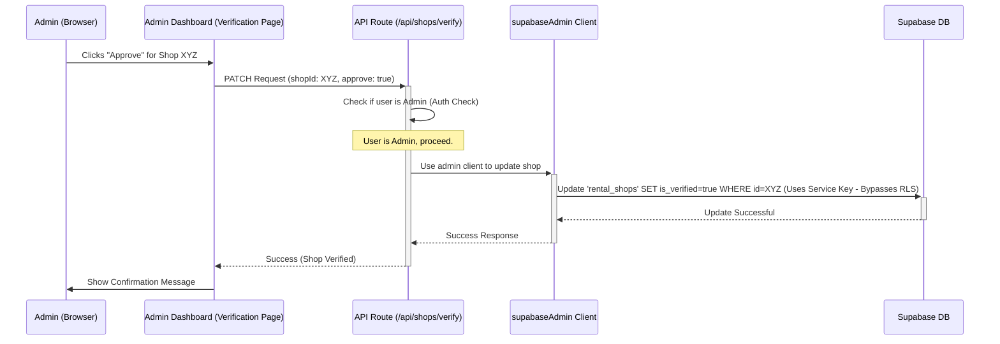

# Chapter 8: Admin Dashboard & Verification

Welcome back! In [Chapter 7: Payment System (PayMongo)](07_payment_system__paymongo__.md), we saw how Siargao Rides securely handles online payments using PayMongo. Now, who keeps an eye on the whole platform, manages users, ensures shops and vehicles are legitimate, and keeps everything running smoothly? That's the job of the platform administrators!

## What Problem Does This Solve? The Platform's Control Room

Imagine Siargao Rides is like a busy airport. You have passengers (tourists), airlines (rental shops), and airplanes (vehicles). But you also need an **air traffic control tower** and airport management to oversee operations, check credentials, manage schedules, and handle any issues.

Without this central control, it would be chaos! How do we know a shop is real? How do we manage user accounts? How do we configure payment options for everyone?

The **Admin Dashboard** is our application's control room. It's a special, restricted area only accessible to users with the `admin` role.

## Meet the Control Room: Admin Dashboard

The Admin Dashboard is a dedicated section of the Siargao Rides website, typically accessed through URLs like `/dashboard/admin`. It's hidden from regular users and shop owners. Only users identified as administrators by our [Authentication & User Roles (AuthContext)](03_authentication___user_roles__authcontext__.md) system can get in.

Think of it as the manager's office or the bridge of a ship. From here, administrators can:

1.  **Manage Users:** View all registered users, potentially add new ones manually, or delete user accounts (like revoking access).
2.  **Oversee Shops & Vehicles:** See all shops and vehicles on the platform, not just their own.
3.  **Verify Shops & Vehicles:** This is crucial! Admins review new shop applications and vehicle listings submitted by owners ([Chapter 6: Shop & Vehicle Management](06_shop___vehicle_management_.md)). They check uploaded documents (like business permits or vehicle registration) to ensure legitimacy. Only *after* an admin approves them do they become visible and bookable by customers.
4.  **Manage Subscriptions:** Oversee the subscription status of shops (e.g., activate trials, manage paid subscriptions).
5.  **Process Deposit Payouts:** Handle the payout of security deposits back to shop owners in specific situations (like cancellations).
6.  **Configure System Settings:** Adjust platform-wide settings, such as enabling or disabling different payment methods (e.g., turning GCash on/off via `/api/settings/payment`) or setting referral program parameters.

## The Verification Workflow: Gatekeeping Quality

One of the most important admin tasks is **verification**. Let's see how it works for a new shop:

1.  **Shop Owner Submits:** A shop owner registers and submits their shop details and required documents through their dashboard ([Chapter 6](06_shop___vehicle_management_.md)). The shop status is initially `pending verification`.
2.  **Admin Review:** An administrator logs into the Admin Dashboard and goes to the "Shop Verification" page (`src/app/dashboard/admin/verification/page.tsx`). They see a list of pending shops.
3.  **Check Details & Documents:** The admin clicks on a pending shop to view its details and the uploaded documents (like ID and business permit). They check if everything looks correct and legitimate.
4.  **Approve or Reject:**
    *   **Approve:** If everything is okay, the admin clicks "Approve". This triggers an API call (e.g., to `/api/shops/verify`).
    *   **Reject:** If something is wrong (e.g., documents unclear, fake info), the admin clicks "Reject". This might also trigger an API call to update the status or potentially delete the entry.
5.  **Backend Update:** The API route receives the admin's decision. Crucially, it uses the special `supabaseAdmin` client ([Chapter 2: Supabase Backend & Admin Client](02_supabase_backend___admin_client_.md)) to update the shop's `is_verified` status in the database. This requires admin privileges because a regular user or shop owner shouldn't be able to verify themselves.
6.  **Shop Goes Live (if Approved):** Once `is_verified` is set to `true`, the shop (and its verified vehicles) become visible to customers browsing the site.

A similar process happens for verifying individual vehicles via `/api/vehicles/verify`.

## How It Works: Admin Actions

1.  **Login:** An admin user logs in. The [AuthContext](03_authentication___user_roles__authcontext__.md) identifies them as having the `admin` role.
2.  **Navigate:** They access the admin section (e.g., `/dashboard/admin/settings`).
3.  **View Data:** The page fetches data relevant to admins (e.g., current system settings from `/api/settings/payment` GET).
4.  **Perform Action:** The admin makes a change (e.g., toggles a payment option switch) and clicks "Save".
5.  **API Call:** The browser sends a request to a specific, admin-only API route (e.g., POST request to `/api/settings/payment`).
6.  **Backend Execution:**
    *   The API route runs on the server.
    *   It *first* checks if the user making the request truly has the `admin` role (using session data from [AuthContext](03_authentication___user_roles__authcontext__.md)).
    *   If authorized, it uses the `supabaseAdmin` client ([Chapter 2](02_supabase_backend___admin_client_.md)) to perform the action (e.g., update the `system_settings` table in the database, bypassing regular user security rules).
    *   It sends a success or error response back.
7.  **Feedback:** The Admin Dashboard shows a confirmation or error message.

## Key Admin Pages and API Routes

*   **Frontend Pages (Examples):**
    *   `src/app/dashboard/admin/page.tsx`: The main admin landing page, often showing stats and links to other admin sections.
    *   `src/app/dashboard/admin/verification/page.tsx`: Page for verifying shops.
    *   `src/app/dashboard/admin/vehicles/verification/page.tsx`: Page for verifying vehicles.
    *   `src/app/dashboard/admin/settings/page.tsx`: Page for managing system settings like payment options.
    *   `src/app/dashboard/admin/subscriptions/page.tsx`: Page for managing shop subscriptions.
    *   `src/app/dashboard/admin/deposit-payouts/page.tsx`: Page for processing deposit payouts.
*   **Backend API Routes (Examples):**
    *   `/api/shops/verify` (PATCH): Used by admins to approve/reject shops. Uses `supabaseAdmin`.
    *   `/api/vehicles/verify` (PATCH): Used by admins to approve/reject vehicles. Uses `supabaseAdmin`.
    *   `/api/settings/payment` (POST): Used by admins to update payment settings. Uses `supabaseAdmin`.
    *   `/api/admin/process-deposit-payout` (POST): Used by admins to process payouts. Uses `supabaseAdmin`.

## Under the Hood: Approving a Shop

Here's a simplified flow showing an admin approving a shop:



## Code Snippets (Simplified)

Let's look at simplified code for some admin actions.

**1. Approving a Shop (API Route)**

This API route handles the admin's approval click.

```typescript
// File: src/app/api/shops/verify/route.ts (Simplified PATCH handler)
import { NextResponse } from 'next/server';
// Import the SPECIAL admin client (See Chapter 2)
import { supabaseAdmin } from '@/lib/admin';
import { createRouteHandlerClient } from '@supabase/auth-helpers-nextjs';
import { cookies } from 'next/headers';

export async function PATCH(request: Request) {
  try {
    const supabase = createRouteHandlerClient({ cookies });
    // 1. Check Authentication & Role
    const { data: { session } } = await supabase.auth.getSession();
    if (!session || session.user.user_metadata?.role !== 'admin') {
      return NextResponse.json({ error: 'Forbidden - Admin only' }, { status: 403 });
    }

    // 2. Get shop ID from the request
    const { shopId, approve } = await request.json();
    if (!shopId) {
      return NextResponse.json({ error: 'Missing shopId' }, { status: 400 });
    }

    if (approve) {
      // 3. Use supabaseAdmin to bypass RLS and update verification status
      const { data, error } = await supabaseAdmin
        .from('rental_shops')          // Target the shops table
        .update({ is_verified: true }) // Set is_verified to true
        .eq('id', shopId)              // Only for this specific shop
        .select()                      // Get the updated data back
        .single();

      if (error) {
        console.error('Error approving shop:', error);
        return NextResponse.json({ error: 'Failed to approve shop' }, { status: 500 });
      }

      // 4. TODO: Potentially update user role, send notification, etc.

      // 5. Send success response
      return NextResponse.json({ success: true, message: 'Shop approved', shop: data });
    } else {
      // TODO: Handle rejection (e.g., update status, delete entry)
      return NextResponse.json({ success: true, message: 'Shop rejected' });
    }

  } catch (error) {
    console.error('Shop verification failed:', error);
    return NextResponse.json({ error: 'Verification failed' }, { status: 500 });
  }
}
```

**Explanation:**

*   It first checks if the user making the request is logged in and has the `admin` role.
*   If approving, it uses the `supabaseAdmin` client (imported from ` '@/lib/admin'`) which has special privileges.
*   `supabaseAdmin.from(...).update(...)` updates the `is_verified` field in the `rental_shops` table. This is allowed because `supabaseAdmin` uses the powerful Service Role Key ([Chapter 2](02_supabase_backend___admin_client_.md)).

**2. Updating Payment Settings (API Route)**

This API route handles saving changes made on the admin settings page.

```typescript
// File: src/app/api/settings/payment/route.ts (Simplified POST handler)
import { createRouteHandlerClient } from '@supabase/auth-helpers-nextjs';
import { cookies } from 'next/headers';
import { NextResponse } from 'next/server';
// Import the SPECIAL admin client
import { supabaseAdmin } from '@/lib/admin';

export async function POST(request: Request) {
  try {
    const supabase = createRouteHandlerClient({ cookies });
    // 1. Check Authentication & Role
    const { data: { session } } = await supabase.auth.getSession();
    if (!session || session.user.user_metadata?.role !== 'admin') {
      return NextResponse.json({ error: 'Forbidden - Admin only' }, { status: 403 });
    }

    // 2. Get the new settings from the request body
    const newSettings = await request.json();
    if (!newSettings || typeof newSettings !== 'object') {
      return NextResponse.json({ error: 'Invalid settings data' }, { status: 400 });
    }

    // 3. Use supabaseAdmin to update the settings in the database
    const { data, error } = await supabaseAdmin
      .from('system_settings')
      .update({ value: newSettings }) // Update the 'value' column (JSON)
      .eq('key', 'payment_settings') // Target the specific settings row
      .select()
      .single();

    if (error) {
      console.error('Error updating payment settings:', error);
      return NextResponse.json({ error: 'Failed to update settings' }, { status: 500 });
    }

    // 4. Send success response
    return NextResponse.json({ success: true, settings: data.value });

  } catch (error) {
    console.error('Update settings failed:', error);
    return NextResponse.json({ error: 'Update failed' }, { status: 500 });
  }
}
```

**Explanation:**

*   Again, it verifies the user is an admin.
*   It uses `supabaseAdmin` to update the `system_settings` table. A specific row identified by `key: 'payment_settings'` holds a JSON object (`value`) containing all payment-related flags (like `enable_paymongo_gcash`).

**3. Processing Deposit Payout (API Route)**

```typescript
// File: src/app/api/admin/process-deposit-payout/route.ts (Simplified)
import { NextRequest, NextResponse } from 'next/server';
import { createServerComponentClient } from '@supabase/auth-helpers-nextjs';
import { cookies } from 'next/headers';
// Import the SPECIAL admin client
import { supabaseAdmin } from '@/lib/admin';

export async function POST(request: NextRequest) {
  try {
    const supabase = createServerComponentClient({ cookies });
    // 1. Check Authentication & Role
    const { data: { user }, error: authError } = await supabase.auth.getUser();
    if (authError || !user || user.user_metadata?.role !== 'admin') {
      return NextResponse.json({ error: 'Forbidden - Admin only' }, { status: 403 });
    }

    // 2. Get rental ID and reason from request
    const { rentalId, reason } = await request.json();
    if (!rentalId) {
      return NextResponse.json({ error: 'Missing rentalId' }, { status: 400 });
    }

    // 3. TODO: Fetch rental details, check if payout is applicable

    // 4. Use supabaseAdmin to create a payout record
    const { data: payout, error: payoutError } = await supabaseAdmin
      .from('deposit_payouts')
      .insert({
        rental_id: rentalId,
        shop_id: 'shop123', // Replace with actual fetched shop ID
        amount: 500,        // Replace with actual fetched deposit amount
        status: 'pending',
        reason: reason || 'Admin processed',
        processed_by: user.id, // Log which admin processed it
      })
      .select()
      .single();

    if (payoutError) throw payoutError;

    // 5. Use supabaseAdmin to update the rental record (mark deposit as processed)
    await supabaseAdmin
      .from('rentals')
      .update({ deposit_processed: true })
      .eq('id', rentalId);

    // 6. Send success response
    return NextResponse.json({ success: true, message: 'Payout processed', payout: payout });

  } catch (error: any) {
    console.error('Deposit payout failed:', error);
    return NextResponse.json({ error: 'Payout failed', details: error.message }, { status: 500 });
  }
}
```

**Explanation:**

*   Verifies admin role.
*   Uses `supabaseAdmin` to insert a record into the `deposit_payouts` table and update the original `rentals` table. These operations need admin rights.

## Conclusion

The Admin Dashboard is the essential **control center** for Siargao Rides Summarised, accessible only to administrators.

*   It allows admins to **manage users, oversee shops/vehicles, handle subscriptions, process payouts, and configure system settings**.
*   A critical function is the **verification** of new shops and vehicles, ensuring quality and legitimacy on the platform.
*   Admin actions performed through the dashboard trigger specific backend [API Routes (`src/app/api/`)](01_api_routes___src_app_api____.md).
*   These API routes rely heavily on the `supabaseAdmin` client ([Chapter 2](02_supabase_backend___admin_client_.md)) to perform privileged operations that bypass standard user security rules (RLS).

What about encouraging users and shops to join the platform? How does the referral system work?

Let's explore that in the next chapter: [Chapter 9: Referral System](09_referral_system_.md)!

---

Generated by [AI Codebase Knowledge Builder](https://github.com/The-Pocket/Tutorial-Codebase-Knowledge)