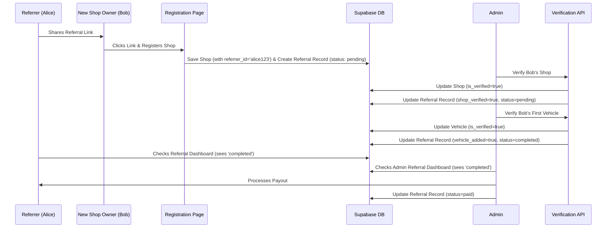

# Chapter 9: Referral System

Welcome back! In [Chapter 8: Admin Dashboard & Verification](08_admin_dashboard___verification_.md), we explored the control center that administrators use to manage Siargao Rides, including the important task of verifying shops and vehicles. Now, how can we encourage more people, especially existing users, to help bring new, quality rental shops onto the platform?

## What Problem Does This Solve? Rewarding Growth

Imagine Siargao Rides wants to grow its selection of shops and vehicles. One way to do this is to ask current users or even non-users to help find and recommend new shop owners. But how do we make it worth their while? And how do we track who recommended whom?

We need a system that:

1.  Lets users easily share a unique link or code.
2.  Tracks when a new shop owner signs up using that link/code.
3.  Checks if the new shop meets certain quality criteria (like getting verified and adding a real vehicle).
4.  Automatically rewards the person who made the successful recommendation.

This is exactly what the **Referral System** does! It's like an automated "finder's fee" program, designed to incentivize and reward users for helping Siargao Rides grow its network of rental shops.

## Meet the Automated Finder's Fee: The Referral System

Think of the Referral System as a smart program that manages rewards for bringing new shop owners to Siargao Rides. It handles the entire process:

1.  **Unique Referral Link:** Each user gets their own special web link they can share (e.g., `https://siargaorides.ph/register?ref=USER_ID`).
2.  **Tracking Connection:** When a potential shop owner clicks this link and signs up, the system remembers *who* sent them. This link is stored in the new shop's profile in the [Supabase Backend & Admin Client](02_supabase_backend___admin_client_.md).
3.  **Monitoring Progress:** The system keeps an eye on the new shop. It checks two main things:
    *   Has the shop been **verified** by an admin ([Chapter 8](08_admin_dashboard___verification_.md))?
    *   Has the shop added at least one **verified vehicle** ([Chapter 6](06_shop___vehicle_management_.md) & [Chapter 8](08_admin_dashboard___verification_.md))?
4.  **Completion & Payout:** Once *both* conditions are met (shop verified AND first vehicle verified), the system marks the referral as 'completed'. This signals that the original referrer is now eligible for a reward (like a 500 PHP payout). Admins can then see these completed referrals and process the payment.

## How It Works: A User's Journey

Let's see how a user, Alice, refers a new shop owner, Bob:

1.  **Alice Gets Her Link:** Alice logs into Siargao Rides, goes to her Dashboard -> Referrals page (`/dashboard/referrals`). She finds her unique referral link: `https://siargaorides.ph/register?ref=alice123`.
2.  **Alice Shares:** Alice sends this link to Bob, who owns a motorbike rental shop but isn't on the platform yet.
3.  **Bob Signs Up:** Bob clicks Alice's link. He's taken to the Siargao Rides registration page (`/register`). The page automatically notes the `ref=alice123` part from the link. Bob completes the sign-up process for his shop.
4.  **System Connects:** The system saves Bob's new shop details and makes a note: "This shop was referred by alice123". This connection is stored in the `rental_shops` table (`referrer_id` column) and a new entry is created in the `referrals` table.
5.  **Bob Gets Verified:** Bob uploads his documents. An admin reviews and approves Bob's shop ([Chapter 8](08_admin_dashboard___verification_.md)). The system automatically updates the referral record: "Shop Verified: YES".
6.  **Bob Adds a Vehicle:** Bob adds his first motorbike via his dashboard ([Chapter 6](06_shop___vehicle_management_.md)). An admin reviews and approves the vehicle ([Chapter 8](08_admin_dashboard___verification_.md)). The system updates the referral record again: "Vehicle Added: YES".
7.  **Referral Complete!** Because both conditions are now met, the system automatically changes the referral status to `completed`.
8.  **Alice Sees Progress:** Alice can check her `/dashboard/referrals` page anytime. She initially saw the referral as 'pending', but now sees it as 'completed' or 'eligible for payout'.
9.  **Admin Pays Out:** An admin sees the 'completed' referral in their `/dashboard/admin/referrals` page and processes the 500 PHP payout to Alice, marking the referral as 'paid'.

## Under the Hood: Tracking the Connection

The system relies on a few key parts working together:

1.  **Referral Link Generation (`src/lib/referral.ts`):** A simple function creates the unique link for each user.

    ```typescript
    // File: src/lib/referral.ts (Simplified)

    // Function to create a referral link based on the user's ID
    export function generateReferralLink(userId: string): string {
      // Get the website's main address (e.g., https://siargaorides.ph)
      const baseUrl = process.env.NEXT_PUBLIC_BASE_URL || 'https://siargaorides.ph';
      // Create the link by adding '/register?ref=USER_ID'
      return `${baseUrl}/register?ref=${userId}`;
    }
    ```

    **Explanation:** This takes the user's unique ID and attaches it to the registration page URL as a parameter (`ref`).

2.  **Capturing the Referrer:** When a new shop owner registers using the link, the registration page's code reads the `ref` parameter from the URL and includes the `referrer_id` when saving the new shop data to the `rental_shops` table.

3.  **The `referrals` Table:** This special table in our [Supabase Backend & Admin Client](02_supabase_backend___admin_client_.md) database acts like a scoreboard for referrals. Each row tracks one referral attempt.

    ```sql
    -- Simplified structure of the 'referrals' table
    CREATE TABLE referrals (
      id UUID PRIMARY KEY, -- Unique ID for this referral record
      referrer_id UUID,   -- Who made the referral (links to users table)
      shop_id UUID,       -- Which shop was referred (links to rental_shops table)
      status VARCHAR,     -- 'pending', 'completed', 'paid'
      shop_verified BOOLEAN DEFAULT FALSE, -- Has the shop been verified?
      vehicle_added BOOLEAN DEFAULT FALSE, -- Has a verified vehicle been added?
      payout_amount NUMERIC DEFAULT 500.00, -- How much is the reward?
      created_at TIMESTAMP, -- When was the referral made?
      updated_at TIMESTAMP  -- When was the status last updated?
      -- ... other fields like paid_at, payment_reference ...
    );
    ```

    **Explanation:** This table links the `referrer_id` (Alice) to the `shop_id` (Bob's shop). The `status`, `shop_verified`, and `vehicle_added` columns track progress.

4.  **Automated Updates via API Routes:** The magic happens when admins verify shops or vehicles. The API routes handling these actions ([Chapter 8](08_admin_dashboard___verification_.md)) have extra logic added.

    *   **Shop Verification (`/api/shops/verify`):** After successfully marking a shop as verified, the code checks if that shop has a `referrer_id`. If yes, it finds the corresponding row in the `referrals` table and updates `shop_verified` to `true`. It then checks if `vehicle_added` is *also* true. If both are true, it sets the `status` to `completed`.

        ```typescript
        // Simplified logic within src/app/api/shops/verify/route.ts PATCH handler
        // ... (inside the block after successfully verifying the shop `data`) ...

        // Check if this shop was referred
        if (data && data.referrer_id) {
          // Check if the shop has at least one verified vehicle already
          const { data: vehicles } = await supabaseAdmin
            .from('vehicles')
            .select('id', { count: 'exact', head: true }) // Just count them
            .eq('shop_id', data.id)
            .eq('is_verified', true);
          const hasVerifiedVehicle = (vehicles?.count ?? 0) > 0;

          // Update the referral record using supabaseAdmin
          await supabaseAdmin
            .from('referrals')
            .update({
              shop_verified: true, // Mark shop as verified in referral table
              // If a vehicle is already verified, mark referral completed
              status: hasVerifiedVehicle ? 'completed' : 'pending',
              updated_at: new Date().toISOString()
            })
            .eq('referrer_id', data.referrer_id) // Find referral by referrer
            .eq('shop_id', data.id);              // and the referred shop
        }
        ```

        **Explanation:** This snippet shows how, after verifying a shop (`data`), the system checks for a referrer. If found, it updates the `referrals` table using the powerful `supabaseAdmin` client ([Chapter 2](02_supabase_backend___admin_client_.md)), potentially marking the referral `completed` if a vehicle was already verified.

    *   **Vehicle Verification (`/api/vehicles/verify`):** Similarly, after verifying a vehicle, the code finds the vehicle's shop. It checks if the shop has a `referrer_id`. If yes, it finds the referral row and updates `vehicle_added` to `true`. It then checks if `shop_verified` is *also* true. If both are true, it sets the `status` to `completed`.

        ```typescript
        // Simplified logic within src/app/api/vehicles/verify/route.ts PATCH handler
        // ... (inside the block after successfully verifying the vehicle `vehicleData`) ...

        // Check if the vehicle's shop was referred
        if (vehicleData && vehicleData.shop_id) {
          // Get the shop's details (referrer_id, is_verified)
          const { data: shop } = await supabaseAdmin
            .from('rental_shops')
            .select('referrer_id, is_verified')
            .eq('id', vehicleData.shop_id)
            .single();

          // If the shop was referred...
          if (shop && shop.referrer_id) {
            // Update the referral record using supabaseAdmin
            await supabaseAdmin
              .from('referrals')
              .update({
                vehicle_added: true, // Mark vehicle added in referral table
                // If the shop is already verified, mark referral completed
                status: shop.is_verified ? 'completed' : 'pending',
                updated_at: new Date().toISOString()
              })
              .eq('referrer_id', shop.referrer_id) // Find referral by referrer
              .eq('shop_id', vehicleData.shop_id);   // and the referred shop
          }
        }
        ```

        **Explanation:** After verifying a vehicle, this code checks if the shop it belongs to was referred. If so, it updates the `referrals` table, potentially marking the referral `completed` if the shop itself was already verified.

5.  **Dashboards:**
    *   **User:** The `/dashboard/referrals` page (`src/app/dashboard/referrals/page.tsx`) fetches data from the `referrals` table for the logged-in user, showing them the status of their referrals.
    *   **Admin:** The `/dashboard/admin/referrals` page (`src/app/dashboard/admin/referrals/page.tsx`) shows all referrals, allowing admins to filter by status (e.g., view 'completed' ones) and mark them as 'paid' after processing the reward.

## Visualizing the Flow

Here’s how a referral progresses automatically:



## Conclusion

The Referral System is a powerful tool for growing the Siargao Rides platform by rewarding users who bring in new, quality shop owners.

*   It uses unique **referral links** to track who referred whom.
*   A dedicated `referrals` table in the [Supabase Backend & Admin Client](02_supabase_backend___admin_client_.md) database monitors the progress.
*   The system **automatically** updates a referral's status when a referred shop and its first vehicle are verified by admins via the [Admin Dashboard & Verification](08_admin_dashboard___verification_.md) process.
*   Once a referral is `completed`, the referrer becomes eligible for a payout, managed by admins.
*   Users and admins can track referral status through their respective dashboards.

Now that we've covered the backend logic, database interactions, user roles, payments, and admin functions, let's look at how the user interface is built and styled to create the visual experience for users.

Let's dive into the frontend presentation layer in [Chapter 10: UI Components & Styling (`src/components`, `tailwind.config.js`)](10_ui_components___styling___src_components____tailwind_config_js__.md)!

---

Generated by [AI Codebase Knowledge Builder](https://github.com/The-Pocket/Tutorial-Codebase-Knowledge)