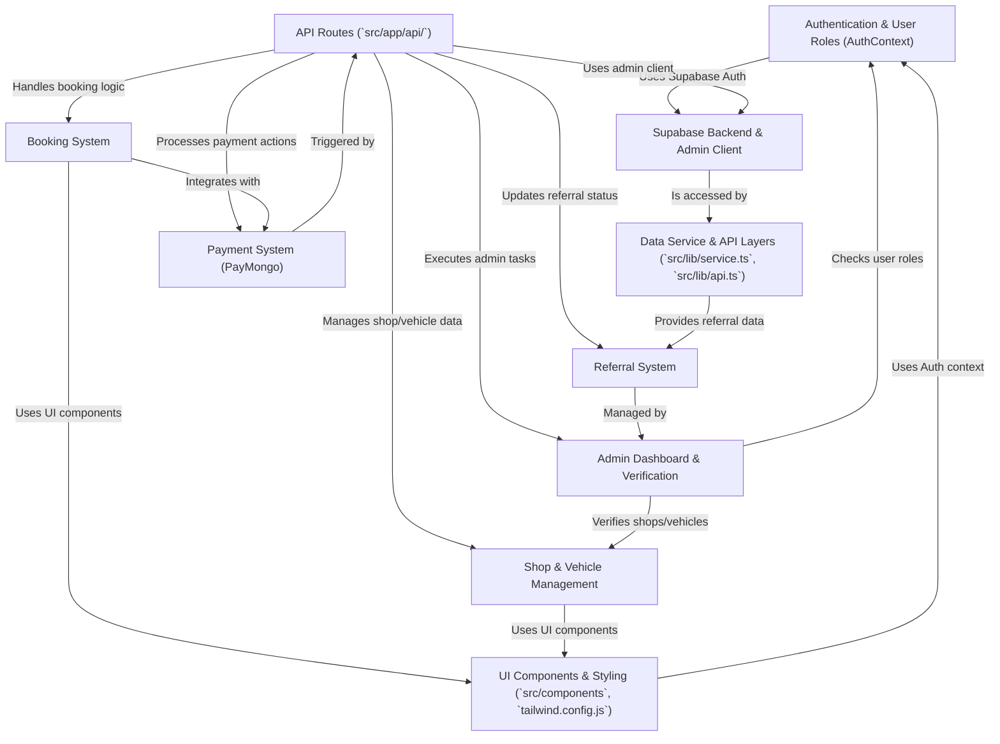

# Tutorial: Siargao Rides Summarised

Siargao Rides is a web platform designed to connect *tourists* with **local vehicle rental shops** in Siargao.
Tourists can *browse*, compare, and book motorcycles, cars, or tuktuks.
Shop owners can **manage their listings**, inventory, and bookings through a dedicated dashboard.
The platform includes features like user authentication, booking management, online payments via PayMongo, shop verification, and an **admin dashboard** for oversight.

**Source Repository:** [https://github.com/Ivanxdigital/siargao-rides](https://github.com/Ivanxdigital/siargao-rides)

## Chapters

1. [API Routes (`src/app/api/`)
](01_api_routes___src_app_api____.md)
2. [Supabase Backend & Admin Client
](02_supabase_backend___admin_client_.md)
3. [Authentication & User Roles (AuthContext)
](03_authentication___user_roles__authcontext__.md)
4. [Data Service & API Layers (`src/lib/service.ts`, `src/lib/api.ts`)
](04_data_service___api_layers___src_lib_service_ts____src_lib_api_ts___.md)
5. [Booking System
](05_booking_system_.md)
6. [Shop & Vehicle Management
](06_shop___vehicle_management_.md)
7. [Payment System (PayMongo)
](07_payment_system__paymongo__.md)
8. [Admin Dashboard & Verification
](08_admin_dashboard___verification_.md)
9. [Referral System
](09_referral_system_.md)
10. [UI Components & Styling (`src/components`, `tailwind.config.js`)
](10_ui_components___styling___src_components____tailwind_config_js___.md)

---

Generated by [AI Codebase Knowledge Builder](https://github.com/The-Pocket/Tutorial-Codebase-Knowledge)